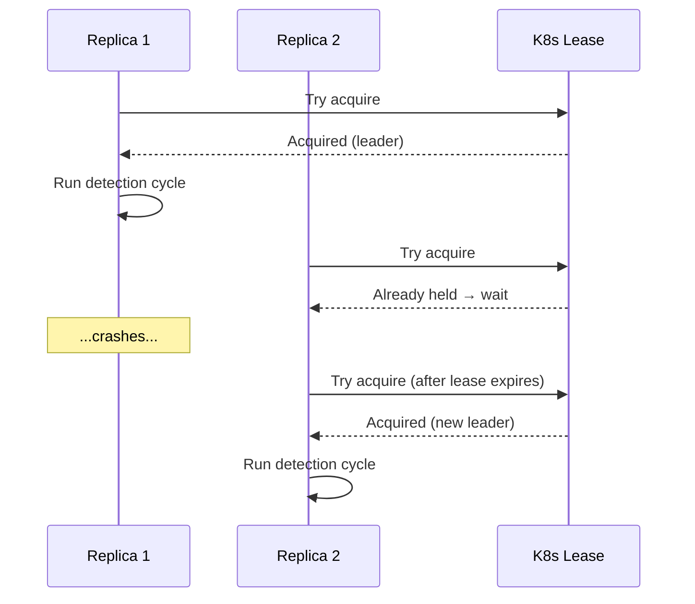

# Components

## Component Summary

| Component | Language | Port | Replicas | Purpose |
|-----------|----------|------|----------|---------|
| Controller | Go | 8080 (metrics) | 1 (leader) | Schedules, correlates, enriches, dispatches |
| Worker | Go | 50052 (gRPC) | 3+ | Executes queries, runs detection, updates baselines |
| ML Service | Python | 50051 (gRPC), 8082 (metrics) | 1 | Prophet forecasting, Isolation Forest |
| Redis | — | 6379 | 1 | Baselines, dedup cooldowns, seasonal profiles |

---

## Controller

The brain of the system. Runs a detection cycle every 30 seconds.

**Responsibilities:**

- Build job batches (static + adaptive + log rules from config)
- Dispatch jobs to workers via gRPC round-robin
- Receive anomaly results from workers
- Run ML multivariate analysis on correlated anomalies
- Enrich alerts with context (CPU, memory, restarts, error rate)
- Correlate and deduplicate (workload grouping, severity escalation)
- Dispatch to Alertmanager (or dry-run log)
- Expose `/metrics` and `/readyz` endpoints

**Key packages:**

| Package | Responsibility |
|---------|---------------|
| `internal/correlation/` | Dedup, workload extraction, severity escalation |
| `internal/enrichment/` | Context queries with template substitution |
| `internal/detection/` | Detection engine orchestration |
| `internal/ml/` | gRPC client to ML service |
| `internal/readiness/` | Health probes for dependencies |
| `internal/replay/` | Offline replay engine |

---

## Workers

Stateless query executors. Scale horizontally.

**Responsibilities:**

- Execute PromQL queries against VictoriaMetrics
- Execute LogQL queries against Loki
- Run detection algorithms (static threshold, adaptive Z-Score)
- Update baselines in Redis (EWMA, Welford statistics)
- Return anomaly results to controller via gRPC

**Scaling:**

- Each worker handles `concurrency: 5` parallel jobs
- Workers are stateless — add more replicas for throughput
- Round-robin load balancing via gRPC `dns:///` resolver

---

## ML Service

Python gRPC service providing advanced detection capabilities.

**Endpoints:**

| RPC | Purpose | Status |
|-----|---------|--------|
| `DetectMultivariate` | Isolation Forest on feature vectors | ✅ Active |
| `Forecast` | Prophet time-series forecasting | ✅ Ready, not yet wired |
| `Health` | gRPC health check | ✅ Active |

**How Isolation Forest works:**

1. Controller sends feature vector (cpu_ratio, memory_ratio, restarts, error_rate, latency, etc.)
2. ML service fits/updates Isolation Forest model
3. Returns anomaly score + contributing features
4. Controller uses score to escalate severity (warning → critical)

!!! warning "Known limitation"
    The current single-model approach fails when feature vector dimensions change between pod-level (6 features) and service-level (3-5 features). Fix planned: separate models per kind.

---

## Redis

Shared state store for the detection pipeline.

**Data stored:**

| Key pattern | Purpose | TTL |
|-------------|---------|-----|
| `baseline:{metric}:{labels}` | EWMA stats (mean, stddev, count) | Persistent |
| `dedup:{alert_hash}` | Cooldown for fired alerts | 5 min |
| `seasonal:{metric}:{hour}:{dow}` | Day-of-week/hour profiles | 7 days |

**Why Redis over in-process state:**

- Workers are stateless and scale independently
- Controller restarts don't lose baseline history
- Dedup works across controller failovers (future HA)

---

## Leader Election (HA)

When running multiple controller replicas in a cluster, K8s Lease-based leader election ensures only one instance is active at a time.

**Why single-leader semantics:**

- Correlation state lives in memory (workload grouping, dedup window)
- Running 2 active controllers would produce duplicate alerts (same anomaly correlated twice)
- Each controller would only see some workers' anomalies (split brain)

**How it works:**



**Configuration:**

```yaml
controller:
  lease_name: staffops-ad-controller
  lease_namespace: monitoring
  leader_election:
    enabled: true        # default: false (single-replica dev mode)
    lease_duration: 15s  # how long a non-leader waits to take over
    renew_deadline: 10s  # must be < lease_duration
    retry_period: 2s     # candidate retry interval
```

**Failover time**: ~17s worst case (`lease_duration + retry_period`).

**Identity**: Each replica uses `POD_NAME` (via K8s downward API) as its identity. Two replicas with the same identity would compete for the same lease — always set distinct values.

**Metrics**:

- `staffops_ad_controller_is_leader` — 1 if this replica leads, 0 otherwise
- `staffops_ad_controller_leader_transitions_total` — increments on each lease acquisition
