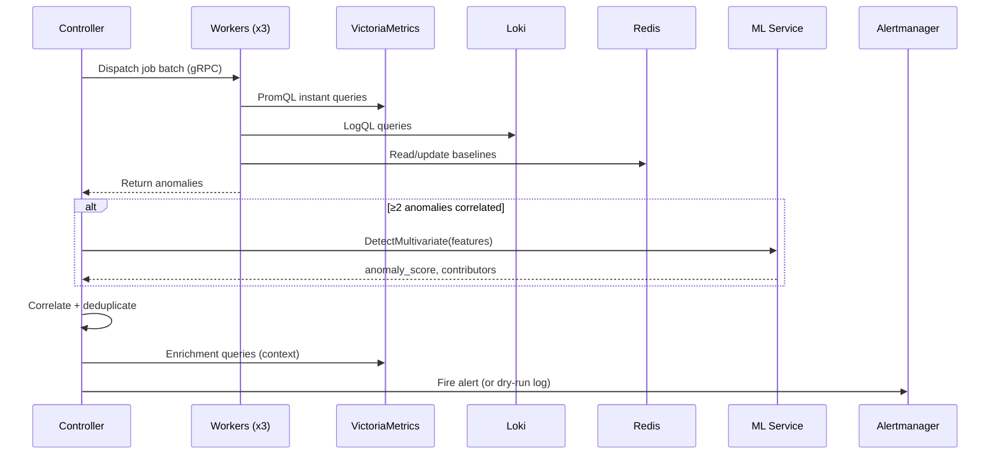

# Data Flow

## Detection Cycle (every 30s)



## Job Lifecycle

```
1. Config defines rules (static, adaptive, log patterns)
2. Controller builds job batch per cycle
3. Jobs dispatched round-robin to workers
4. Each worker:
   a. Executes query (VM or Loki)
   b. Compares result against threshold or baseline
   c. If anomalous → returns Anomaly{metric, labels, value, severity}
   d. Updates baseline in Redis (EWMA alpha=0.3)
5. Controller collects all anomalies from workers
6. Correlation engine:
   a. Groups by workload (pod name → deployment extraction)
   b. Checks dedup cooldown in Redis (5min TTL)
   c. Escalates severity if multi-signal (metrics + logs)
   d. Detects workload patterns (≥3 sibling pods)
7. ML evaluation (if ≥2 correlated anomalies):
   a. Builds feature vector from enrichment results
   b. Calls Isolation Forest
   c. If ML confirms → escalate warning → critical
8. Enrichment:
   a. Queries additional context (CPU ratio, memory, restarts)
   b. Builds deep links (Grafana, Tempo, Loki)
9. Dispatch:
   a. Formats alert payload with annotations
   b. Sends to Alertmanager (or logs in dry-run)
```

## Alert Payload

An enriched alert contains:

```json
{
  "labels": {
    "alertname": "AnomalyDetected",
    "namespace": "production",
    "pod": "api-server-7f8b9c-x2k4p",
    "workload": "api-server",
    "detector": "adaptive",
    "severity": "critical",
    "kind": "pod"
  },
  "annotations": {
    "summary": "Z-Score anomaly on cpu_by_workload",
    "cpu_ratio": "0.92",
    "memory_ratio": "0.78",
    "restarts_5m": "2",
    "error_rate_1m": "0.05",
    "ml_score": "0.87",
    "ml_features": "cpu_ratio,memory_ratio,restarts_5m,error_rate_1m,latency_p99_5m",
    "grafana_url": "https://grafana.example.com/explore?...",
    "tempo_url": "https://grafana.example.com/explore?...",
    "loki_url": "https://grafana.example.com/explore?...",
    "runbook_url": "https://docs.example.com/runbooks/adaptive"
  }
}
```

## Baseline Learning

```mermaid
graph LR
    V[New Value] --> E[EWMA Update]
    E --> S[Welford Stats]
    S --> M[Mean + StdDev]
    M --> Z[Z-Score = |value - mean| / stddev]
    Z --> D{Z > threshold?}
    D -->|Yes| A[Anomaly]
    D -->|No| N[Normal]
```

- **EWMA alpha**: 0.3 (recent values weighted more)
- **Warm-up**: 60 samples before detection activates
- **Seasonal**: Compares to same hour/day-of-week after 7 days of history
