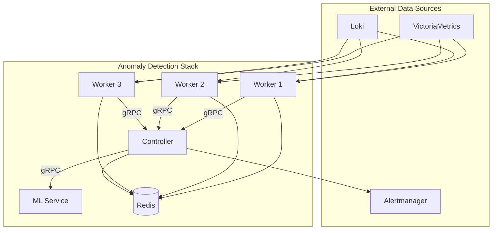

# Architecture

## Overview

The system follows a distributed controller-worker pattern with an external ML service for advanced detection.



## Design Principles

| Principle | Implementation |
|-----------|---------------|
| **12-Factor** | All config via env vars, stateless processes, backing services |
| **Separation of concerns** | Workers detect, Controller correlates, ML enriches |
| **Fail-open** | ML/enrichment failures don't block detection cycle |
| **Idempotent** | Redis dedup ensures same anomaly isn't alerted twice |
| **Observable** | `staffops_ad_*` metrics with 5 sub-namespaces |

## Key Invariants

1. **Detection cycle never blocks** — if a query fails, skip and continue
2. **No state on disk** — all state in Redis (baselines, dedup, seasonal)
3. **Same binary everywhere** — env vars differentiate environments
4. **ML is optional** — system works without ML service (graceful degradation)
5. **Dry-run is default** — must explicitly disable for real alert dispatch

## Repository Structure

```
staffops-anomaly-detection/
├── controller/          # Go — controller + workers + detection engine
│   ├── cmd/             # Entrypoints (controller, worker)
│   ├── internal/        # All business logic
│   │   ├── baseline/    # EWMA + Welford statistics
│   │   ├── correlation/ # Dedup, workload grouping, severity
│   │   ├── detection/   # Static, adaptive, pattern engines
│   │   ├── enrichment/  # Context queries (CPU, memory, etc.)
│   │   ├── ingestion/   # VM + Loki query clients
│   │   ├── ml/          # gRPC client to ML service
│   │   ├── readiness/   # Health probe checks
│   │   ├── replay/      # Offline replay engine
│   │   └── metrics/     # Prometheus instrumentation
│   ├── proto/           # Protobuf definitions
│   ├── config.yaml      # Main configuration
│   └── deploy/          # K8s manifests
├── ml/                  # Python — ML service
│   ├── server/          # gRPC server implementation
│   ├── proto/           # Protobuf source
│   └── Dockerfile
├── scripts/             # Operational tooling
│   ├── docker-compose.yaml
│   ├── start.sh / stop.sh
│   └── monitor*.sh      # TUI dashboards
└── docs/                # This documentation
```
