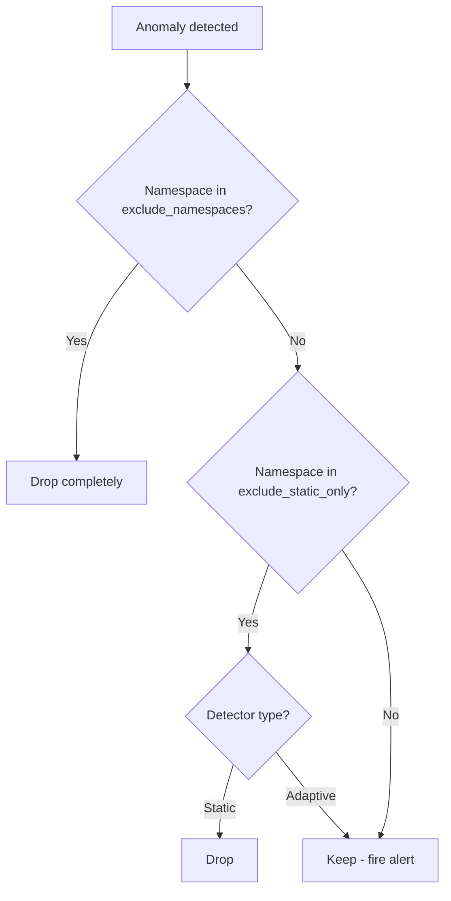

# Suppression

## Overview

Suppression prevents known-noisy workloads from generating false positive alerts. Two levels:

| Level | Effect | Use case |
|-------|--------|----------|
| **Full exclusion** | No detection at all | System namespaces (`kube-system`) |
| **Static-only exclusion** | Static rules suppressed, adaptive still fires | Batch/cron namespaces |

## Configuration

```yaml
suppression:
  exclude_namespaces_csv: ${EXCLUDE_NAMESPACES_CSV:kube-system}
  exclude_static_only_csv: ${EXCLUDE_STATIC_ONLY_CSV:}
```

Both are comma-separated lists passed via environment variables. **Never hardcode namespace lists in the repo** — they are org-specific.

## Environment Variables

```bash
# .env example
EXCLUDE_NAMESPACES_CSV=kube-system,kube-node-lease,kube-public
EXCLUDE_STATIC_ONLY_CSV=batch-processing,data-pipeline,etl-jobs
```

## How It Works



## Rationale

### Why suppress static for batch namespaces?

Batch/cron workloads have unpredictable resource usage:

- A CronJob that runs every hour will spike CPU to 100% — that's normal
- Static rule `cpu > 90%` would fire every hour → noise
- But if the same workload suddenly uses 10x its historical baseline → that's a real anomaly

**Solution**: Suppress static rules (known thresholds) but keep adaptive (learned baselines). The adaptive detector learns the batch pattern and only fires on true deviations.

### Why not suppress everything for batch?

Because real problems still happen in batch namespaces:

- OOMKilled during a job that usually succeeds
- Latency spike 5x above normal for that job
- Sudden restart loop

Adaptive detection catches these because it knows what "normal" looks like for that specific workload.

## Common Patterns

| Namespace type | Recommended suppression |
|----------------|------------------------|
| System (`kube-system`, `monitoring`) | Full exclusion |
| Batch/ETL | Static-only exclusion |
| Infrastructure (Istio, cert-manager) | Static-only exclusion |
| Application workloads | No suppression |

!!! tip "Tuning tip"
    Use the [Replay Mode](../operations/replay.md) to identify which namespaces generate the most noise, then add them to the appropriate suppression list.
