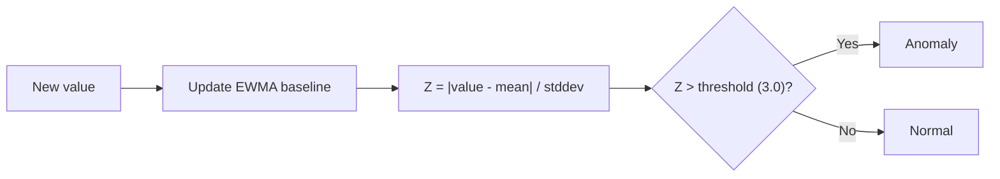

# Adaptive Z-Score Detection

## How It Works

Learns a baseline for each metric series using EWMA (Exponentially Weighted Moving Average) and Welford's online algorithm. Fires when the current value deviates significantly from the learned normal.



## Algorithm Details

### EWMA Baseline

Each metric series maintains running statistics in Redis:

```
mean(t) = α × value + (1 - α) × mean(t-1)
```

Where `α = 0.3` (configurable via `baseline.ewma_alpha`).

### Welford's Online Algorithm

Computes variance incrementally without storing all values:

```
count += 1
delta = value - mean
mean += delta / count
delta2 = value - mean
M2 += delta × delta2
variance = M2 / (count - 1)
stddev = sqrt(variance)
```

### Z-Score Calculation

```
z_score = |value - mean| / stddev
```

If `z_score > zscore_threshold` (default 3.0), the value is anomalous.

## Configuration

```yaml
baseline:
  window_size: 60          # Number of samples in sliding window
  ewma_alpha: 0.3          # Smoothing factor (0-1, higher = more reactive)
  zscore_threshold: 3.0    # Standard deviations for anomaly
  warm_up_samples: 60      # Samples before detection activates
  seasonal_min_days: 7     # Days before seasonal comparison activates
```

### Adaptive Metrics

```yaml
detection:
  adaptive_metrics:
    - name: cpu_by_workload
      query: max(rate(container_cpu_usage_seconds_total{...}[1m])) by (namespace, pod)
      group_by: [namespace, pod]

    - name: error_rate_by_service
      query: sum(rate(spanmetrics_apm_calls_total{status_code="STATUS_CODE_ERROR"}[1m])) by (service_name)
      group_by: [service_name]

    - name: latency_p99_by_service
      query: histogram_quantile(0.99, sum(rate(spanmetrics_apm_duration_milliseconds_bucket[5m])) by (le, service_name))
      group_by: [service_name]
```

## Warm-up Phase

!!! info "Warm-up"
    The detector requires `warm_up_samples` (default 60) data points before it starts detecting. During warm-up, it only learns — no anomalies are emitted.

    At 30s intervals, warm-up takes **30 minutes** (60 × 30s).

## Seasonal Awareness

After `seasonal_min_days` (7 days) of history, the detector also compares against the same hour and day-of-week. This prevents false positives on:

- Monday morning traffic spikes
- Nightly batch job CPU usage
- End-of-month processing peaks

## Tuning

| Parameter | Effect of increasing | Effect of decreasing |
|-----------|---------------------|---------------------|
| `ewma_alpha` | More reactive to recent changes | More stable, slower to adapt |
| `zscore_threshold` | Fewer alerts (less sensitive) | More alerts (more sensitive) |
| `warm_up_samples` | Longer before detection starts | Faster start, less stable baseline |

!!! tip "Use Replay Mode to tune"
    Run `controller --replay --from=24h` with different thresholds to see how anomaly count changes. See [Replay Mode](../operations/replay.md).
