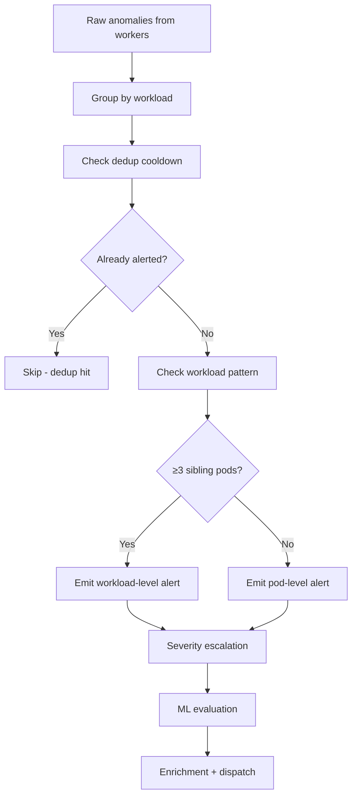

# Correlation Engine

## Overview

The correlation engine groups, deduplicates, and escalates anomalies before they become alerts. It prevents alert storms and provides workload-level context.

## Pipeline



## Workload Extraction

Pod names are parsed to extract the parent workload:

| Resource Type | Pattern | Example |
|---------------|---------|---------|
| Deployment | `<name>-<rs_hash>-<pod_hash>` | `api-server-7f8b9c-x2k4p` → `api-server` |
| StatefulSet | `<name>-<N>` | `redis-0` → `redis` |
| DaemonSet | `<name>-<5-char>` | `fluent-bit-k8x2p` → `fluent-bit` |

## Deduplication

Redis-based cooldown prevents the same anomaly from firing repeatedly:

- **Key**: `dedup:{namespace}/{workload}/{detector}`
- **TTL**: 5 minutes (configurable via `controller.cooldown`)
- **Behavior**: If key exists → skip alert. If not → fire and set key.

## Workload Pattern Detection

When **≥3 sibling pods** of the same workload are anomalous within the correlation window (2 minutes):

1. Emit **one** workload-level alert (instead of N pod alerts)
2. Suppress individual pod alerts for that workload
3. Set severity to `critical` (workload-wide issue)

**Metrics:**

- `staffops_ad_detection_workload_patterns_total` — workload patterns detected
- `staffops_ad_detection_pod_alerts_suppressed_total` — individual pod alerts suppressed

!!! info "Configuration"
    ```yaml
    controller:
      correlation_window: 2m
      cooldown: 5m
      workload_pattern_min_pods: 3  # minimum sibling pods for workload pattern
    ```

## Severity Escalation

| Condition | Result |
|-----------|--------|
| Single metric anomaly | Keep original severity |
| Metric + log anomaly (same workload, within window) | Escalate to `critical` |
| ML Isolation Forest confirms | Escalate to `critical` |
| Workload pattern (≥3 pods) | `critical` |

## Service-Level Correlation

For service-level metrics (error rate, latency, request rate), the workload key uses `service_name` instead of `namespace/pod`:

- Metrics like `error_rate_by_service` have `service_name` label but no `pod`
- Correlation groups by service identity
- Enrichment uses the service bundle (error rate, request rate, latency)

!!! bug "Known Issue"
    Service-level anomalies currently collapse into empty workload key `"/"` when namespace/pod are empty. Fix planned: use `service_name` as fallback in `workloadKey()`.
