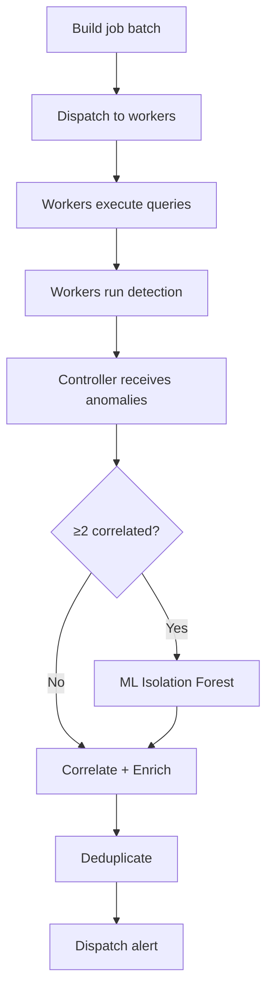

# Detection

## Overview

The system uses multiple detection methods in combination, each suited to different anomaly types.

| Method | Detector | Best for |
|--------|----------|----------|
| [Static threshold](static.md) | `static` | Known limits (CPU > 90%, restarts > 3) |
| [Adaptive Z-Score](adaptive.md) | `adaptive` | Unexpected spikes/drops relative to learned baseline |
| [Log patterns](logs.md) | `adaptive` / `pattern_match` | Error rate spikes, panic/OOM in logs |
| [ML Multivariate](ml.md) | `ml_isolation_forest` | Correlated anomalies across multiple metrics |
| [Correlation](correlation.md) | — | Workload grouping, dedup, severity escalation |

## Detection Cycle

Every **30 seconds** (configurable via `controller.job_interval`):

## Signal Types

### Metrics (VictoriaMetrics)

- CPU usage ratio per pod
- Memory usage ratio per pod
- Restart rate per pod
- Error rate per service (from span metrics)
- Request rate per service
- Latency P99 per service

### Logs (Loki)

- Error rate by namespace
- Log volume by workload
- Pattern matching (panic, OOM, fatal)

### Events (K8s)

- CrashLoopBackOff
- OOMKilled
- Evicted
- FailedScheduling
- BackOff

## Severity Levels

| Severity | Meaning | Escalation trigger |
|----------|---------|-------------------|
| `info` | Detected but low confidence | Single signal, within noise |
| `warning` | Anomaly confirmed | Z-Score > threshold OR static breach |
| `critical` | High confidence, multi-signal | ML confirms OR multi-signal correlation |

Severity escalation rules:

1. **Multi-signal**: warning metric + warning log in same workload → critical
2. **ML confirmation**: ML Isolation Forest confirms anomaly → warning → critical
3. **Workload pattern**: ≥3 sibling pods anomalous simultaneously → workload-level critical
