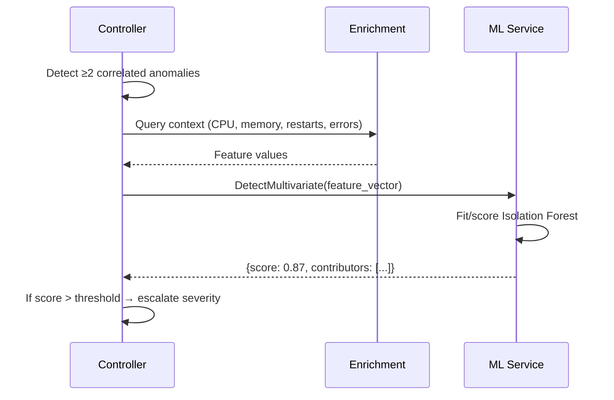

# ML Integration

## Overview

The ML service provides two capabilities:

| Method | Algorithm | Status |
|--------|-----------|--------|
| **Multivariate detection** | Isolation Forest | ✅ Active |
| **Forecasting** | Prophet | ✅ Ready, not yet wired |

## Isolation Forest (Multivariate)

Detects anomalies by analyzing **multiple features simultaneously**. A single metric spike might be normal, but CPU spike + memory spike + error rate spike together is suspicious.

### How It Works



### Feature Vector

The feature vector is built from enrichment results:

| Feature | Source | Description |
|---------|--------|-------------|
| `anomaly_score` | Detection | Original Z-Score or threshold breach magnitude |
| `anomaly_value` | Detection | Raw metric value |
| `cpu_ratio` | Enrichment | CPU usage / CPU limit |
| `memory_ratio` | Enrichment | Memory usage / Memory limit |
| `restarts_5m` | Enrichment | Container restarts in last 5 minutes |
| `error_rate_1m` | Enrichment | Error rate from span metrics |
| `latency_p99_5m` | Enrichment | P99 latency from span metrics |
| `ready_replicas` | Enrichment | Pod readiness status |

### Severity Escalation

When ML confirms an anomaly (score above threshold):

- `warning` → `critical`
- Alert annotations include `ml_score`, `ml_features`, `ml_contributors`

### Configuration

```yaml
ml:
  endpoint: ${ML_ENDPOINT:ml:50051}
  enabled: ${ML_ENABLED:true}
  timeout: ${ML_TIMEOUT:5s}
```

!!! warning "Known Issue"
    Single Isolation Forest model fails when feature dimensions change between pod-level (6+ features) and service-level (3-5 features). Planned fix: separate models per kind.

---

## Prophet Forecasting (Not Yet Wired)

Prophet predicts future values based on historical time-series. Planned use:

- Predict threshold breach within 30 minutes
- Proactive alerting before actual breach occurs
- Requires baseline store to expose time-series history (currently only stats)

### Planned Flow

```
1. Periodic forecast job (once per hour per series with sufficient history)
2. Prophet fits model on historical data
3. Predicts next 30min
4. If prediction crosses threshold → emit forecast anomaly
5. Cache forecast in Redis (Prophet is ~500ms-2s per series)
```

**Blocked on**: Baseline store schema extension (needs sliding window of values + timestamps, not just stats).

---

## ML Service Details

**Language**: Python 3.11  
**Framework**: gRPC (grpc.aio)  
**Port**: 50051 (gRPC), 8082 (Prometheus metrics)

### Metrics Exposed

| Metric | Type | Description |
|--------|------|-------------|
| `staffops_ad_ml_requests_total` | Counter | Total gRPC requests by method and status |
| `staffops_ad_ml_request_duration_seconds` | Histogram | Request latency |
| `staffops_ad_ml_multivariate_anomalies_total` | Counter | Anomalies detected by Isolation Forest |

### Health Check

Standard gRPC health check protocol:

```bash
grpcurl -plaintext ml:50051 grpc.health.v1.Health/Check
```
