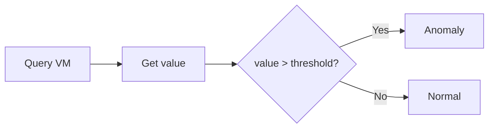

# Static Threshold Detection

## How It Works

Compares a metric value against a fixed threshold. Simplest detection method — fires when `value > threshold` (or `<`, depending on operator).



## Configuration

Static rules are defined in `config.yaml` under `detection.static_rules`:

```yaml
detection:
  static_rules:
    - name: high_cpu_ratio
      query: |
        max(rate(container_cpu_usage_seconds_total{namespace!~"...",container!=""}[1m])) by (namespace, pod)
        / max(kube_pod_container_resource_limits{resource="cpu",...}) by (namespace, pod)
      threshold: 0.9
      operator: ">"
      severity: warning

    - name: high_restart_rate
      query: |
        max(increase(kube_pod_container_status_restarts_total{...}[5m])) by (namespace, pod)
      threshold: 3
      operator: ">"
      severity: critical

    - name: high_memory_ratio
      query: |
        max(container_memory_working_set_bytes{...}) by (namespace, pod)
        / max(kube_pod_container_resource_limits{resource="memory",...}) by (namespace, pod)
      threshold: 0.85
      operator: ">"
      severity: warning
```

## Default Rules

| Rule | Query | Threshold | Severity |
|------|-------|-----------|----------|
| `high_cpu_ratio` | CPU usage / CPU limit | > 0.9 (90%) | warning |
| `high_restart_rate` | Restarts in 5min | > 3 | critical |
| `high_memory_ratio` | Memory usage / Memory limit | > 0.85 (85%) | warning |

## When to Use

!!! tip "Best for"
    - Known hard limits (resource exhaustion)
    - Conditions that are always bad regardless of history
    - Simple, predictable workloads

!!! warning "Limitations"
    - Doesn't adapt to workload patterns (batch jobs will false-positive)
    - Use [suppression](../configuration/suppression.md) for noisy namespaces
    - Consider [adaptive detection](adaptive.md) for variable workloads

## Suppression Interaction

Static rules respect the `exclude_static_only_csv` suppression list. Namespaces in this list skip static detection but still run adaptive detection.

This is useful for batch/cron namespaces where CPU spikes are expected but true anomalies (Z-Score deviations) should still fire.
