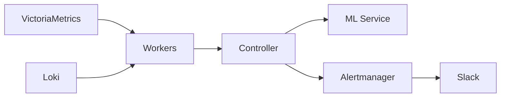

# StaffOps Anomaly Detection

Distributed anomaly detection system for Kubernetes clusters. Combines adaptive statistical detection (Go) with ML-based forecasting and multivariate analysis (Python).

---

## What is this?

A complementary detection layer that sits alongside traditional alerting (VMAlert/Prometheus). It detects anomalies that static thresholds miss — gradual degradation, correlated failures, and workload-level patterns.



## Key Features

| Feature | Description |
|---------|-------------|
| **Adaptive baselines** | EWMA + Welford's algorithm learns normal behavior per metric |
| **Multi-signal** | Metrics (VM) + Logs (Loki) + K8s Events |
| **ML correlation** | Isolation Forest detects multivariate anomalies |
| **Workload-aware** | Groups pod-level anomalies into workload-level alerts |
| **Enrichment** | Alerts carry context (CPU ratio, memory, restarts, error rate) |
| **Deep links** | Grafana, Tempo, Loki links anchored at anomaly timestamp |
| **Replay mode** | Validate config changes against historical data offline |
| **Zero side effects** | Dry-run mode for safe rollout |

## Architecture at a Glance

```
Controller (Go)          Workers (Go, x3)         ML Service (Python)
┌──────────────┐        ┌──────────────┐         ┌──────────────┐
│ Scheduler    │──gRPC──│ VM queries   │         │ Prophet      │
│ Correlator   │        │ Loki queries │         │ Isolation    │
│ Enrichment   │        │ Detection    │         │ Forest       │
│ Dispatcher   │──gRPC──│ Baselines    │         └──────┬───────┘
└──────┬───────┘        └──────┬───────┘                │
       │                       │                   gRPC │
       │                ┌──────▼───────┐                │
       │                │    Redis     │         ┌──────▼───────┐
       └────────────────│  Baselines   │─────────│  Controller  │
                        │  Dedup TTL   │         └──────────────┘
                        └──────────────┘
```

## Quick Navigation

- :material-sitemap: [**Architecture**](architecture/index.md) — System design, components, data flow
- :material-chart-bell-curve: [**Detection**](detection/index.md) — Algorithms, methods, correlation
- :material-cog: [**Configuration**](configuration/index.md) — Rules, suppression, enrichment
- :material-play-circle: [**Operations**](operations/index.md) — Quick start, replay, monitoring
- :material-code-braces: [**Development**](development/index.md) — Build, test, contribute

## Current Status

!!! success "Controller v0.7.0 — MVP Enriched"
    - Static + Adaptive + Log detection functional
    - ML Isolation Forest integrated (multivariate)
    - Workload-aware correlation
    - Alert enrichment with deep links
    - Replay mode 75% complete (12/16 tasks)

!!! warning "Dry-run mode"
    Currently running in dry-run — alerts are generated but not dispatched to Alertmanager. Pending observability hardening (Phase 4) before production activation.
