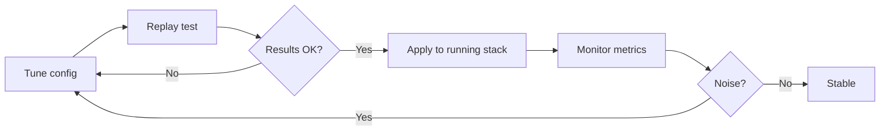

# Operations

## Guides

- [**Quick Start**](quickstart.md) — Get the stack running in 5 minutes
- [**Replay Mode**](replay.md) — Validate config changes against historical data
- [**Monitoring**](monitoring.md) — Metrics, dashboards, health checks
- [**Troubleshooting**](troubleshooting.md) — Common issues and solutions

## Operational Model

## Current Deployment

| Environment | Mode | Stack |
|-------------|------|-------|
| Local (docker-compose) | Dry-run | Controller + 3 Workers + Redis + ML |
| Cluster (planned) | Dry-run → Live | K8s Deployment + IRSA + ArgoCD |

## Key Operational Metrics

| Metric | Healthy range | Alert if |
|--------|--------------|----------|
| `staffops_ad_controller_cycle_duration_seconds` | < 15s | p99 > 30s |
| `staffops_ad_worker_queries_total{status="error"}` | < 5% | > 10% |
| `staffops_ad_ml_calls_total{status="error"}` | < 5% | > 10% |
| `staffops_ad_detection_anomalies_total` | Varies | Sudden 10x spike |
| `staffops_ad_alert_dedup_hits_total` | > 50% of fires | 0% (dedup broken) |
