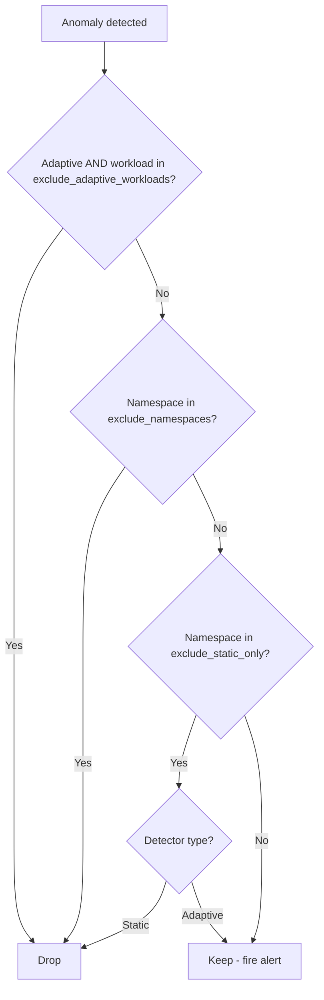

# Suppression

## Overview

Suppression prevents known-noisy workloads from generating false positive alerts. Three levels:

| Level | Scope | Effect | Use case |
|-------|-------|--------|----------|
| **Full exclusion** | Namespace | No detection at all | System namespaces (`kube-system`) |
| **Static-only exclusion** | Namespace | Static rules suppressed, adaptive still fires | Batch/cron namespaces |
| **Adaptive-workload exclusion** | Workload | Adaptive (Z-Score) suppressed, static/logs still fire | Bursty infra (brokers, collectors, mesh) |

## Configuration

```yaml
suppression:
  exclude_namespaces_csv: ${EXCLUDE_NAMESPACES_CSV:kube-system}
  exclude_static_only_csv: ${EXCLUDE_STATIC_ONLY_CSV:}
  exclude_adaptive_workloads_csv: ${EXCLUDE_ADAPTIVE_WORKLOADS_CSV:}
```

All three are comma-separated lists passed via environment variables. **Never hardcode namespace or workload lists in the repo** — they are org-specific.

The workload in `exclude_adaptive_workloads_csv` is matched the same way the
`staffops_ad_detection_anomalies_by_workload_total` metric labels it: the pod name
via `ExtractWorkload` (e.g. `strimzi-kafka-brokers-0` → `strimzi-kafka-brokers`),
falling back to `service_name` for span-metric anomalies that carry no pod label.
Use the values you see in the "top noisy workloads" view directly.

## Environment Variables

```bash
# .env example
EXCLUDE_NAMESPACES_CSV=kube-system,kube-node-lease,kube-public
EXCLUDE_STATIC_ONLY_CSV=batch-processing,data-pipeline,etl-jobs
EXCLUDE_ADAPTIVE_WORKLOADS_CSV=strimzi-kafka-brokers,otel-agent-logs-collector,istiod
```

## How It Works



Suppression runs in the worker, before anomalies are returned to the controller.
Each drop is counted in `staffops_ad_worker_anomalies_suppressed_total{detector,reason}`
(reasons: `namespace_all`, `namespace_static`, `adaptive_workload`) so the effect is
observable — see the [metrics reference](../reference/metrics.md).

## Rationale

### Why suppress static for batch namespaces?

Batch/cron workloads have unpredictable resource usage:

- A CronJob that runs every hour will spike CPU to 100% — that's normal
- Static rule `cpu > 90%` would fire every hour → noise
- But if the same workload suddenly uses 10x its historical baseline → that's a real anomaly

**Solution**: Suppress static rules (known thresholds) but keep adaptive (learned baselines). The adaptive detector learns the batch pattern and only fires on true deviations.

### Why not suppress everything for batch?

Because real problems still happen in batch namespaces:

- OOMKilled during a job that usually succeeds
- Latency spike 5x above normal for that job
- Sudden restart loop

Adaptive detection catches these because it knows what "normal" looks like for that specific workload.

### Why suppress adaptive for specific infra workloads?

Some infrastructure components are *inherently* bursty in a way the adaptive detector
cannot learn away: message brokers (Kafka), telemetry collectors (OTel), and service-mesh
proxies (Istio) have high-variance resource and error-rate profiles by design. Their
Z-Score crosses the threshold constantly, producing the dominant share of false positives
— yet they share a namespace with real application workloads, so namespace-level
suppression is too blunt.

**Solution**: `exclude_adaptive_workloads_csv` silences only the *adaptive* signal for the
named workloads, workload by workload, while their *static* breaches (e.g. OOM, restart
loops) and log patterns still fire. It is namespace-independent for exactly this reason.

## Common Patterns

| Workload / namespace type | Recommended suppression |
|----------------|------------------------|
| System (`kube-system`, `monitoring`) | Full exclusion (namespace) |
| Batch/ETL namespaces | Static-only exclusion (namespace) |
| Bursty infra (Kafka, OTel collectors, Istio, Pyroscope) | Adaptive-workload exclusion |
| Application workloads | No suppression |

!!! tip "Tuning tip"
    Use the [Replay Mode](../operations/replay.md) to identify which namespaces generate the most noise, then add them to the appropriate suppression list.
