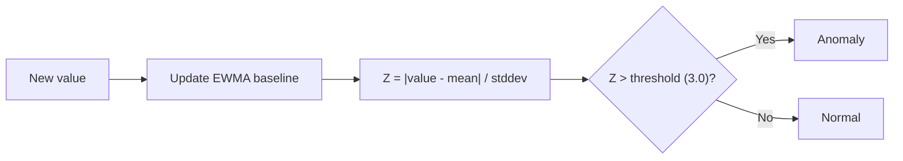

# Adaptive Z-Score Detection

## How It Works

Learns a baseline for each metric series using EWMA (Exponentially Weighted Moving Average) and Welford's online algorithm. Fires when the current value deviates significantly from the learned normal.



## Algorithm Details

### EWMA Baseline

Each metric series maintains running statistics in Redis:

```
mean(t) = α × value + (1 - α) × mean(t-1)
```

Where `α = 0.3` (configurable via `baseline.ewma_alpha`).

### Welford's Online Algorithm

Computes variance incrementally without storing all values:

```
count += 1
delta = value - mean
mean += delta / count
delta2 = value - mean
M2 += delta × delta2
variance = M2 / (count - 1)
stddev = sqrt(variance)
```

### Z-Score Calculation

```
z_score = |value - mean| / stddev
```

If `z_score > zscore_threshold` (default 3.0), the value is anomalous.

## Configuration

```yaml
baseline:
  window_size: 60          # Number of samples in sliding window
  ewma_alpha: 0.3          # Smoothing factor (0-1, higher = more reactive)
  zscore_threshold: 3.0    # Standard deviations for anomaly
  warm_up_samples: 60      # Samples before detection activates
  seasonal_min_days: 7     # Days before seasonal comparison activates
```

### Adaptive Metrics

```yaml
detection:
  adaptive_metrics:
    - name: cpu_by_workload
      query: max(rate(container_cpu_usage_seconds_total{...}[1m])) by (namespace, pod)
      group_by: [namespace, pod]

    - name: error_rate_by_service
      query: sum(rate(spanmetrics_apm_calls_total{status_code="STATUS_CODE_ERROR"}[1m])) by (service_name)
      group_by: [service_name]

    - name: latency_p99_by_service
      query: histogram_quantile(0.99, sum(rate(spanmetrics_apm_duration_milliseconds_bucket[5m])) by (le, service_name))
      group_by: [service_name]
```

## Warm-up Phase

!!! info "Warm-up"
    The detector requires `warm_up_samples` (default 60) data points before it starts detecting. During warm-up, it only learns — no anomalies are emitted.

    At 30s intervals, warm-up takes **30 minutes** (60 × 30s).

## False Discovery Rate control (multiple comparisons)

Running a z-score test on ~400 adaptive series every cycle is a multiple-comparison problem: at a fixed `z > 3` threshold, a fraction of series cross it by chance alone, producing a steady stream of statistical false positives (~1000/day from this effect alone).

The controller applies a [Benjamini-Hochberg](https://en.wikipedia.org/wiki/False_discovery_rate#Benjamini%E2%80%93Hochberg_procedure) FDR filter once per cycle, **after** worker detection and **before** correlation. It converts each adaptive anomaly's z-score to a two-tailed p-value and keeps only those that survive the BH step-up at `controller.fdr_target` (default `0.05` = 5% expected false discoveries). Static and pattern anomalies are not part of the family — they always pass through.

!!! warning "The family size must be the number of tests, not the number of anomalies"
    BH needs the **full** family size `m` — every adaptive evaluation performed this cycle, whether or not it fired. Workers only ship anomalies (series past the z threshold), so the filter cannot infer `m` from what it receives: that censored family is a handful of uniformly tiny p-values, and BH over it accepts nearly everything.

    Workers therefore report `adaptive_series_tested` (evaluations past warm-up) on each `JobResults`, and the controller passes it as `m`. A marginal anomaly (z≈3.0) that would pass against `m=1` is correctly rejected once the cycle's ~400 tests are counted, while genuinely strong signals survive. The gauge `staffops_ad_detection_fdr_family_size` exposes `m` — a value near 0 while anomalies fire means the family has collapsed to the censored case. See [metrics reference](../reference/metrics.md#staffops_ad_detection_fdr_family_size).

## Direction-of-badness

The z-score is symmetric — `|z| > 3` fires whether a metric spikes **up** or **down**. But most metrics are only anomalous one way: latency, error rate, queue depth, and GC heap matter when they **rise**; ready replicas and (arguably) throughput when they **fall**. Without a direction, the detector alerts even when a metric *improves* (latency dropped, errors fell) — a pure false positive.

Declare `direction` on an adaptive rule to fire only the bad way:

```yaml
- name: latency_p99_by_service
  query: histogram_quantile(0.99, sum(rate(http_server_request_duration_seconds_bucket[5m])) by (le, cluster, service_name))
  group_by: [cluster, service_name]
  direction: up_bad     # up_bad | down_bad | both_bad (default when empty)
```

The controller derives the deviation direction from `Value` vs `Mean` (both carried on the anomaly) and drops wrong-direction firings **before** FDR — so they don't consume FDR acceptance either. `both_bad` (or an empty field) keeps the original symmetric behavior, so the field is backward-compatible. Drops are counted by `staffops_ad_detection_direction_filtered_total`.

!!! tip "When to keep `both_bad`"
    Traffic/throughput rules (`request_rate`) stay `both_bad` — a sudden **drop** can signal an upstream outage just as a spike signals a storm.

## Seasonal Awareness

After `seasonal_min_days` (7 days) of history, the detector also compares against the same hour and day-of-week. This prevents false positives on:

- Monday morning traffic spikes
- Nightly batch job CPU usage
- End-of-month processing peaks

## Tuning

| Parameter | Effect of increasing | Effect of decreasing |
|-----------|---------------------|---------------------|
| `ewma_alpha` | More reactive to recent changes | More stable, slower to adapt |
| `zscore_threshold` | Fewer alerts (less sensitive) | More alerts (more sensitive) |
| `warm_up_samples` | Longer before detection starts | Faster start, less stable baseline |

!!! tip "Use Replay Mode to tune"
    Run `controller --replay --from=24h` with different thresholds to see how anomaly count changes. See [Replay Mode](../operations/replay.md).
