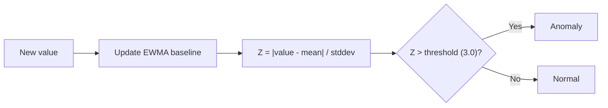

# Adaptive Z-Score Detection

## How It Works

Learns a baseline for each metric series using EWMA (Exponentially Weighted Moving Average) and Welford's online algorithm. Fires when the current value deviates significantly from the learned normal.



## Algorithm Details

### EWMA Baseline

Each metric series maintains running statistics in Redis:

```
mean(t) = α × value + (1 - α) × mean(t-1)
```

Where `α = 0.3` (configurable via `baseline.ewma_alpha`).

### Welford's Online Algorithm

Computes variance incrementally without storing all values:

```
count += 1
delta = value - mean
mean += delta / count
delta2 = value - mean
M2 += delta × delta2
variance = M2 / (count - 1)
stddev = sqrt(variance)
```

### Z-Score Calculation

```
z_score = |value - mean| / stddev
```

If `z_score > zscore_threshold` (default 3.0), the value is anomalous.

## Configuration

```yaml
baseline:
  window_size: 60          # Number of samples in sliding window
  ewma_alpha: 0.3          # Smoothing factor (0-1, higher = more reactive)
  zscore_threshold: 3.0    # Standard deviations for anomaly
  warm_up_samples: 60      # Samples before detection activates
  seasonal_min_days: 7     # Days before seasonal comparison activates
```

### Adaptive Metrics

```yaml
detection:
  adaptive_metrics:
    - name: cpu_by_workload
      query: max(rate(container_cpu_usage_seconds_total{...}[1m])) by (namespace, pod)
      group_by: [namespace, pod]

    - name: error_rate_by_service
      query: sum(rate(spanmetrics_apm_calls_total{status_code="STATUS_CODE_ERROR"}[1m])) by (service_name)
      group_by: [service_name]

    - name: latency_p99_by_service
      query: histogram_quantile(0.99, sum(rate(spanmetrics_apm_duration_milliseconds_bucket[5m])) by (le, service_name))
      group_by: [service_name]
```

## Warm-up Phase

!!! info "Warm-up"
    The detector requires `warm_up_samples` (default 60) data points before it starts detecting. During warm-up, it only learns — no anomalies are emitted.

    At 30s intervals, warm-up takes **30 minutes** (60 × 30s).

## False Discovery Rate control (multiple comparisons)

Running a z-score test on ~400 adaptive series every cycle is a multiple-comparison problem: at a fixed `z > 3` threshold, a fraction of series cross it by chance alone, producing a steady stream of statistical false positives (~1000/day from this effect alone).

The controller applies a [Benjamini-Hochberg](https://en.wikipedia.org/wiki/False_discovery_rate#Benjamini%E2%80%93Hochberg_procedure) FDR filter once per cycle, **after** worker detection and **before** correlation. It converts each adaptive anomaly's z-score to a two-tailed p-value and keeps only those that survive the BH step-up at `controller.fdr_target` (default `0.05` = 5% expected false discoveries). Static and pattern anomalies are not part of the family — they always pass through.

!!! warning "The family size must be the number of tests, not the number of anomalies"
    BH needs the **full** family size `m` — every adaptive evaluation performed this cycle, whether or not it fired. Workers only ship anomalies (series past the z threshold), so the filter cannot infer `m` from what it receives: that censored family is a handful of uniformly tiny p-values, and BH over it accepts nearly everything.

    Workers therefore report `adaptive_series_tested` (evaluations past warm-up) on each `JobResults`, and the controller passes it as `m`. A marginal anomaly (z≈3.0) that would pass against `m=1` is correctly rejected once the cycle's ~400 tests are counted, while genuinely strong signals survive. The gauge `staffops_ad_detection_fdr_family_size` exposes `m` — a value near 0 while anomalies fire means the family has collapsed to the censored case. See [metrics reference](../reference/metrics.md#staffops_ad_detection_fdr_family_size).

!!! warning "On the deployed rule set, FDR rejects ≈0% (measured 2026-07-20)"
    BH accepts **every** fired anomaly whenever the per-evaluation firing count
    `k` exceeds `m·target` (family size × target) — the step-up finds a high `k`
    that satisfies `p(k) ≤ (k/m)·target` and accepts all ranks below it. On the
    deployed service-level rule set this is the normal regime: ~50–90 series fire
    per evaluation against a family of ~1000–1500, so `k > m·0.05` and BH rejects
    nothing. Two independent sources confirm it: the **live cluster** reports
    ~82.3k accepted / **0 rejected over 24h**, and a synthetic-injection replay
    (both `target=1.0` and `target=0.05`) rejected **0** on the same rule set.

    FDR does cut in the opposite regime — one high-cardinality rule with few
    firings relative to its family (per-pod CPU: ~3% cut) — but that is not how the
    deployed set behaves. **Recall is preserved** either way (injected faults that
    match survive). Net: on the deployed rules the FDR is effectively a no-op; the
    real FP levers are direction-of-badness, rule hygiene, and the z-threshold —
    not the FDR. See `specs/synthetic-injection/`.

## Direction-of-badness

The z-score is symmetric — `|z| > 3` fires whether a metric spikes **up** or **down**. But most metrics are only anomalous one way: latency, error rate, queue depth, and GC heap matter when they **rise**; ready replicas and (arguably) throughput when they **fall**. Without a direction, the detector alerts even when a metric *improves* (latency dropped, errors fell) — a pure false positive.

Declare `direction` on an adaptive rule to fire only the bad way:

```yaml
- name: latency_p99_by_service
  query: histogram_quantile(0.99, sum(rate(http_server_request_duration_seconds_bucket[5m])) by (le, cluster, service_name))
  group_by: [cluster, service_name]
  direction: up_bad     # up_bad | down_bad | both_bad (default when empty)
```

The controller derives the deviation direction from `Value` vs `Mean` (both carried on the anomaly) and drops wrong-direction firings **before** FDR — so they don't consume FDR acceptance either. `both_bad` (or an empty field) keeps the original symmetric behavior, so the field is backward-compatible. Drops are counted by `staffops_ad_detection_direction_filtered_total`.

!!! tip "When to keep `both_bad`"
    Traffic/throughput rules (`request_rate`) stay `both_bad` — a sudden **drop** can signal an upstream outage just as a spike signals a storm.

## Absolute floor (`min_value`)

The z-score is **scale-free** by construction: it measures how unusual a reading is *for that
series*, never whether the reading is large enough to act on. On a gauge that idles near zero
the stddev collapses, so a handful of units becomes a 6–14σ event.

Measured on the live cluster (2026-07-21, 6h = 1109 fired alerts), this — not the
multiple-comparisons problem — was the dominant false-positive source:

| Rule | Share of fired alerts | Median z | Median reading | Median baseline |
|------|----------------------|----------|----------------|-----------------|
| `http_client_active_requests` | **30.7%** | 6.0 | **2 requests** | 0.09 |
| `dotnet_heap_growth` (deleted, see below) | 23.2% | 4.7 | 312 MB | 76 MB |

The minimum `|z|` observed among these firings was 3.27 and the median 6.0, so **raising
`zscore_threshold` would not have removed them** — the readings really are statistical
outliers. They are simply not operationally interesting: a pod going from 0.09 to 2
in-flight outbound requests is a quiet service waking up, not an incident.

Measured floor sensitivity for `http_client_active_requests`:

| `min_value` | Dropped from this rule | Cut in total alert volume |
|---|---|---|
| 5 | 65.7% | 20.2% |
| 10 | 71.0% | 21.8% |
| **20** (chosen) | **85.6%** | **26.3%** |
| 50 | 90.6% | 27.9% |

Returns saturate past 20, so 20 is the knee.

`min_value` adds the missing magnitude test. A rule fires only when the deviation is **both**
statistically significant **and** large enough to matter:

```yaml
- name: http_client_active_requests
  query: max(http_client_active_requests) by (cluster, namespace, pod)
  group_by: [cluster, namespace, pod]
  direction: up_bad
  min_value: 20     # a quiet pod at 0.08 → 2 in-flight requests is not an incident
```

The floor is compared against `|Value|` and applied in the controller **before** FDR, so
floored firings don't consume BH acceptance. Omitted or `0` disables it (backward-compatible),
and static/log-pattern detections are never floored. Drops are counted by
`staffops_ad_detection_floor_filtered_total`. Replay mirrors the same filter and reports the
count as `floor_filtered`.

!!! tip "Floor, don't staticize"
    The alternative — replacing the rule with a static threshold — throws away the per-series
    adaptivity that makes the rule useful (one service idles at `0.1`, another legitimately
    runs at `80`). The floor keeps the learned baseline and only mutes what is too small to
    act on. Pick the floor from the *distribution of real incidents*, not from the baseline:
    the goal is to sit above operational noise, not just above the mean.

!!! warning "A floor cannot rescue a rule measured on the wrong axis"
    `min_value` gates *magnitude*; it cannot fix a metric that is not comparable across
    services in the first place. `dotnet_heap_growth` alerted on **absolute heap bytes**, so
    any floor either cut a real leak on a small container or waved through a large service
    idling above it. The heap/limit ratio measured across every .NET pod was `q50=0.042`,
    `q99=0.205`, `max=0.524` — **not one pod near memory pressure**, yet the rule produced
    23% of all alerts. The right move was to change the measurement, not to floor it:

    ```yaml
    query: max(process_runtime_dotnet_gc_heap_size_bytes) by (pod)
      / on(pod) group_left(cluster, namespace)
        max(container_spec_memory_limit_bytes{container!=""}) by (cluster, namespace, pod)
    ```

    Ask "is this reading comparable across the series the rule covers?" before reaching for
    a floor. If the answer is no, normalize first — then the floor becomes meaningful.

!!! danger "Don't ship a rule that can never fire"
    The ratio above still needed a floor, and every candidate sat at or above the observed
    fleet maximum (`0.524`) — the rule would have shipped permanently silent. It was
    **deleted instead of shipped disabled**.

    A rule that never fires is worse than no rule: it puts the signal on the coverage list
    without covering anything, and nobody discovers the gap until the incident it was
    supposed to catch. If tuning a rule lands you at "it will basically never fire", that is
    not a tuned rule — either derive the threshold from real failures (here: the heap/limit
    ratio observed *before actual OOMKills*, not the distribution of healthy pods) or remove
    the rule and say so.

## Label alignment (`group_by` must match the metric)

A rule's `group_by` names the labels that identify a series. If the metric does not carry
those labels, they resolve to **empty** — the anomaly still fires, but with no namespace and
no cluster, so it cannot be routed, correlated, or drilled into.

This bit both offending rules above: OTel SDK metrics carry `service_namespace` and
`eks_cluster`, **not** `namespace` and `cluster`, so 100% of their alerts came out with an
empty namespace. Map them explicitly:

```yaml
query: 'label_replace(label_replace(
          max(http_client_active_requests) by (eks_cluster, service_namespace, pod),
          "namespace", "$1", "service_namespace", "(.*)"),
          "cluster", "$1", "eks_cluster", "(.*)")'
group_by: [cluster, namespace, pod]
```

Verify before shipping a rule: run the query and confirm every label in `group_by` comes back
populated. An empty grouping label also silently merges series that should be distinct.

## Seasonal Awareness

After `seasonal_min_days` (7 days) of history, the detector also compares against the same hour and day-of-week. This prevents false positives on:

- Monday morning traffic spikes
- Nightly batch job CPU usage
- End-of-month processing peaks

## Tuning

| Parameter | Effect of increasing | Effect of decreasing |
|-----------|---------------------|---------------------|
| `ewma_alpha` | More reactive to recent changes | More stable, slower to adapt |
| `zscore_threshold` | Fewer alerts (less sensitive) | More alerts (more sensitive) |
| `warm_up_samples` | Longer before detection starts | Faster start, less stable baseline |

!!! tip "Use Replay Mode to tune"
    Run `controller --replay --from=24h` with different thresholds to see how anomaly count changes. See [Replay Mode](../operations/replay.md).
