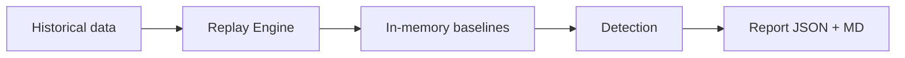

# Replay Mode

## Overview

Simulate detection over historical metrics/logs with a candidate config, **before** applying it in production. Zero side effects.



**Guarantees:**

- ❌ No Redis writes
- ❌ No Alertmanager dispatches
- ❌ No gRPC fan-out to workers
- ❌ No ML calls (V1)
- ✅ Uses same detection engine as production

## Usage

```bash
controller --replay \
  --from=24h \
  --to=now \
  --config=candidate.yaml \
  --output=report.json
```

## CLI Flags

| Flag | Default | Description |
|------|---------|-------------|
| `--replay` | `false` | Enable replay mode |
| `--from` | (required) | Window start — duration (`24h`, `30m`, `7d`) or RFC3339 timestamp |
| `--to` | `now` | Window end — duration or RFC3339 |
| `--config` | `config.yaml` | Config file to evaluate |
| `--output` | `./replay-report.json` | Report output path (`.json` + `.md` written) |
| `--warmup-fraction` | `0.2` | Fraction of window used to warm baselines |
| `--max-range` | `7d` | Maximum allowed window size |
| `--max-anomalies` | `1000` | Cap anomalies in report |

## How It Works

### 1. Window Parsing

Accepts relative durations or absolute timestamps:

```bash
--from=24h --to=now          # Last 24 hours
--from=24h --to=1h           # 24h ago to 1h ago
--from=2026-05-30T00:00:00Z  # Absolute start
```

### 2. Warm-up Phase

The first portion of the window is used to build baselines (no anomalies emitted):

```
warmup_duration = max(0.2 × window, warm_up_samples × tick_interval)
```

For a 24h window with defaults: `max(4.8h, 30min) = 4.8h` warm-up.

### 3. Tick Simulation

After warm-up, the engine simulates detection cycles:

- Fetches data in 1-hour chunks via Prometheus/Loki range queries
- Iterates ticks at `job_interval` (30s) steps
- Runs the same detection engine as production
- Accumulates anomalies in memory

### 4. Report Generation

Outputs both JSON and Markdown:

- `report.json` — machine-readable, full anomaly details
- `report.md` — human-readable tables with ASCII sparklines

## Report Structure

```json
{
  "metadata": {
    "schema_version": "1",
    "window": {"from": "...", "to": "..."},
    "warmup_end": "...",
    "config_path": "candidate.yaml",
    "result_status": "anomalies_detected",
    "execution_metrics": {
      "duration_seconds": 45.2,
      "ticks_processed": 2304,
      "ticks_skipped_query_error": 3,
      "vm_queries_total": 4608,
      "memory_peak_mb": 128
    }
  },
  "totals": {
    "anomalies": 142,
    "by_severity": {"warning": 98, "critical": 44},
    "by_detector": {"static": 23, "adaptive": 119},
    "by_kind": {"pod": 130, "workload": 12},
    "top_workloads": [...]
  },
  "timeline": [...],
  "anomalies": [...]
}
```

## Use Cases

### Tune Z-Score Threshold

```bash
# Current threshold (3.0)
controller --replay --from=24h --config=config.yaml --output=baseline.json

# Candidate threshold (3.5 — less sensitive)
controller --replay --from=24h --config=candidate.yaml --output=candidate.json

# Compare: candidate should have fewer anomalies
jq '.totals.anomalies' baseline.json candidate.json
```

### Validate New Rules

```bash
# Add a new adaptive metric, replay to see what it catches
controller --replay --from=7d --config=new-rules.yaml --output=new-rules.json
```

### Identify Noisy Workloads

```bash
# Check top workloads by anomaly count
jq '.totals.top_workloads[:10]' report.json
```

## Constraints

| Constraint | Value | Reason |
|------------|-------|--------|
| Minimum window | 2.5h | Warm-up needs enough data |
| Maximum window | 7d (configurable) | Memory and query volume |
| Max anomalies | 1000 (configurable) | Report size |
| ML | Disabled in V1 | Stateful model doesn't fit replay |

## Error Handling

- **Query failure on a tick**: logged as warning, tick skipped, replay continues
- **SIGTERM/SIGINT**: flushes partial report (marked `partial`), exits cleanly
- **Pre-flight failure** (Prometheus/Loki unreachable): fails fast before processing

!!! info "Status"
    Replay mode is 75% complete (12/16 tasks). Integration test, smoke test, and final docs are pending. See [Roadmap](../roadmap.md).
